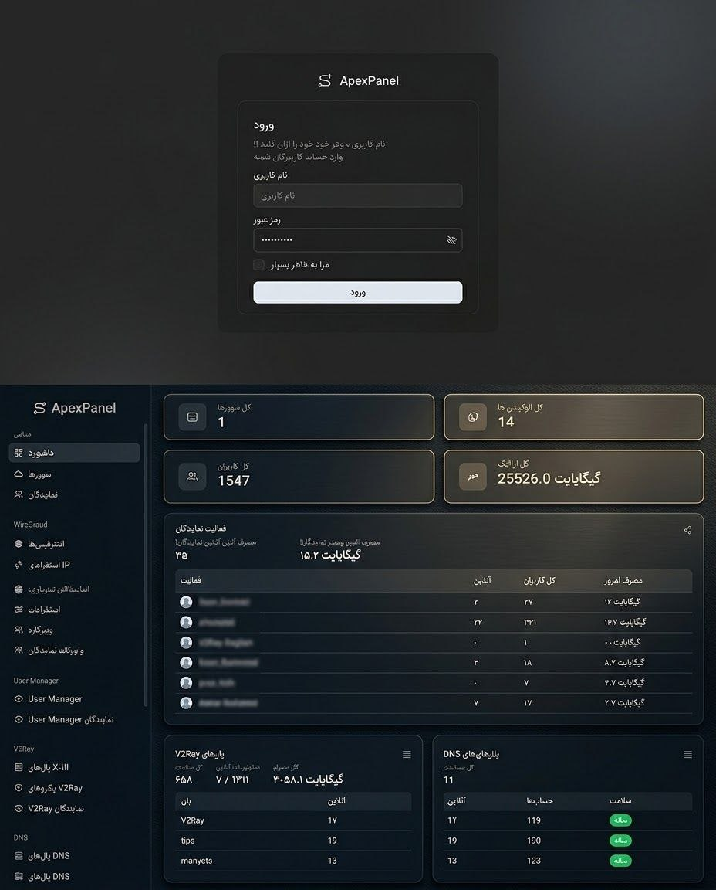

# ApexPanel

A full-featured, self-hosted reseller/VPN management platform built with **Go** (Echo) and **React + TypeScript**.
ApexPanel started as a Mikrotik WireGuard panel and has grown into a multi-protocol control plane: WireGuard,
V2Ray (via x-ui panels), and DNS-based tunnels, each with their own reseller billing, traffic packages, and
Telegram bot integration — all from one admin/reseller web UI.

**🇮🇷 [نسخه‌ی فارسی را اینجا بخوانید](#فارسی)**

---

## Table of Contents

- [Features](#features)
- [How ApexPanel Compares](#how-apexpanel-compares)
- [Screenshots](#screenshots)
- [System Requirements](#system-requirements)
- [Getting Started](#getting-started)
  - [One-Command Install (Ubuntu)](#one-command-install-ubuntu)
  - [Other Platforms](#other-platforms)
- [Build From Source](#build-from-source)
  - [Prerequisites](#prerequisites)
  - [Project Setup](#project-setup)
- [Configuration](#configuration)
- [Usage](#usage)
- [Updating](#updating)
- [Licensing](#licensing)
- [Security](#security)
- [Roadmap](#roadmap)
- [Support](#support)
- [Contributing](#contributing)
- [License](#license)
- [Contact](#contact)

---

## Features

### Multi-protocol tunnel management

- 🔌 **WireGuard** — create, update, share, and monitor peers directly against your Mikrotik RouterOS device(s)
- 🌐 **V2Ray** — integrates with externally-hosted x-ui panels to provision, sync, and quota-manage V2Ray clients
- 🧭 **DNS tunnels** — manage DNS-panel-backed accounts as a third, independent protocol alongside WireGuard/V2Ray
  _(actively used in production; more panel-side polish and features are coming soon)_
- 📱 **User Manager** — a separate protocol/account type with its own traffic pools and reseller quotas
- 📲 **Application** — a fourth protocol/account type for mobile app access, with its own plans and quotas
  _(early support; expanded features coming soon)_

### Reseller & billing

- 👥 Multi-level reseller accounts, each scoped to their own peers/accounts/packages
- 💰 Wallet system with prepaid and postpaid (debt-limited) billing modes
- 📦 Purchasable traffic packages per protocol (WireGuard, User Manager, V2Ray)
- 📊 Per-reseller quotas, usage tracking, and automatic suspend/resume when quota limits are crossed
- 🧾 Ledger-based accounting with full transaction history

### Automation & self-service

- ⏱️ Automatic peer/account expiration (TTL) and traffic-limit enforcement
- 📤 Share peer configs with end users via secure links and QR codes, with no login required
- 🤖 **Telegram bot** for admin notifications, and an optional per-reseller dedicated sales bot ("Bot X")
  that resellers can run as their own independent storefront
- 🩺 Self-healing checks for V2Ray/DNS sync drift, broken webhooks, and other operational issues

### Platform

- 🔑 License-gated activation (online or self-service free trial) with a locked-in license server per install
- 🛡️ Security dashboard: threat detection (shared accounts, multi-country access, scanning patterns), OTP/IP-ban
  protection, and audit-friendly logging
- 🎨 Light/dark themes, fully responsive UI
- 🗄️ SQLite or PostgreSQL — pick the dialect that fits your deployment size
- 🐳 Single static binary or Docker image; same build runs on Linux, macOS, and Windows

---

## How ApexPanel Compares

A quick look at how ApexPanel stacks up against typical single-protocol VPN/tunnel panels:

| | ApexPanel | Typical single-protocol panel |
|---|---|---|
| Protocols in one panel | WireGuard + V2Ray + DNS tunnels + User Manager | Usually just one (e.g. V2Ray only) |
| Reseller system | Multi-level, with wallet billing & per-protocol quotas | Rarely built in, or very limited |
| Dedicated sales bot per reseller | ✅ ("Bot X") | ❌ |
| Tunnel health monitoring & self-healing | ✅ dedicated dashboard | ❌ |
| License-backed activation + free trial | ✅ 30-day, no card required | Varies |
| Persian (Farsi) UI | ✅ fully native, RTL | Rarely |
| x-ui panel compatibility | ✅ supported as a V2Ray backend | — |

More protocols, dashboards, and automation are planned — see the [Roadmap](#roadmap), and feel free to
open an issue with a feature request.

---

## Screenshots

### Login & Dashboard



---

## System Requirements

ApexPanel is a single lightweight Go binary — it runs comfortably on small, inexpensive VPS plans:

| | Minimum | Recommended |
|---|---|---|
| CPU | 1 vCPU | 2 vCPU |
| RAM | 512 MB | 1–2 GB |
| Disk | 2 GB free | 10 GB+ free (grows with usage history/logs) |
| OS | Ubuntu 20.04+ | **Ubuntu 22.04 LTS** or **Ubuntu 24.04 LTS** |
| Database | SQLite (built-in, no setup) | PostgreSQL for larger/busier installs |

Actual needs scale with how many peers/accounts and resellers you manage, and how many protocols
(WireGuard/V2Ray/DNS/User Manager) are active at once.

---

## Getting Started

### One-Command Install (Ubuntu)

The fastest way to get ApexPanel running on a fresh Ubuntu 22.04/24.04 server. This single command installs
Go and Node.js if needed, clones the repository, builds the frontend and backend, and sets up ApexPanel as a
systemd service — tested end to end on a clean server:

```bash
curl -fsSL https://raw.githubusercontent.com/hossein-radfer/APEX-PANEL/main/deploy/quick-install.sh | sudo bash
```

To activate with a license key on first boot (optional — you can also activate later from the web UI), append it
after `--`:

```bash
curl -fsSL https://raw.githubusercontent.com/hossein-radfer/APEX-PANEL/main/deploy/quick-install.sh | sudo bash -s -- --license-key MWP-XXXX-XXXX-XXXX-XXXX
```

See [`deploy/install.sh --help`](deploy/install.sh) (run after the clone) for every other option, including
custom admin credentials and `--db-dialect postgres`.

> [!TIP]
> Default port for the web panel is `3000`.

> [!CAUTION]
> Default username for the admin account is `ApexPanel`. If `ADMIN_PASSWORD` is left unset, a random password is
> generated on first boot and printed **once** to the console/log — save it immediately, it cannot be recovered
> afterward. Always change the default username and password from the panel once logged in.

> [!IMPORTANT]
> The admin username/password environment variables only take effect on the very first run (when the admin
> account is seeded). Changing them afterward requires using the panel's own account settings page, not the env.
> When changing your password from the panel's Settings page, it must be **at least 8 characters** long.

### Other Platforms

Pre-built binary releases (Linux/macOS/Windows) and a Docker image are planned but not published yet — for now,
build from source (see [Build From Source](#build-from-source) below), or use the one-command installer above on
Ubuntu.

```bash
docker-compose up -d
```

---

## Build From Source

### Prerequisites

- **Go** 1.20 or later
- **Node.js** 18 or later
- **pnpm**
- A Mikrotik RouterOS device with API access (for WireGuard management)
- PostgreSQL or SQLite, depending on your chosen `DB_DIALECT`

### Project Setup

```bash
git clone https://github.com/hossein-radfer/APEX-PANEL.git
cd mwp

cp api/config/.env.example api/.env
# Edit api/.env with your settings

cd api
go mod tidy
go run cmd/main.go

# in a second terminal
cd ui
pnpm install
pnpm run dev
```

Visit `http://localhost:3000` in your browser.

---

## Configuration

ApexPanel is configured entirely through environment variables. Copy
[`api/config/.env.example`](api/config/.env.example) to `.env` (in the `api` directory for manual setups, or the
project root for Docker) and adjust as needed. The most commonly changed variables:

| Variable         | Description                                                                                                                                    | Default               | Required |
|-------------------|--------------------------------------------------------------------------------------------------------------------------------------------|------------------------|----------|
| `SERVER_HOST`     | IP address the backend listens on.                                                                                                          | `0.0.0.0`              | No       |
| `SERVER_PORT`     | Port for the backend Go API server.                                                                                                         | `3000`                 | No       |
| `DB_DIALECT`      | `sqlite` or `postgres`.                                                                                                                      | `sqlite`               | No       |
| `ADMIN_USERNAME`  | Username for the panel's admin account (seeded on first run only).                                                                          | `ApexPanel`            | No       |
| `ADMIN_PASSWORD`  | Password for the admin account. If unset, a random password is generated on first boot and printed once to the log — set this to choose your own. | _(random, generated)_ | No       |
| `LICENSE_KEY`     | Your issued license key. Only needed once, on first activation; stored in the database afterward.                                          | _(empty)_              | No       |
| `TELEGRAM_BOT_TOKEN` | Bot token for the panel's own admin-notification Telegram bot.                                                                            | _(empty)_              | No       |

See [`api/config/.env.example`](api/config/.env.example) for the full list, including database credentials,
logging options, the Telegram reseller-bot default proxy, and license server settings.

---

## Usage

1. **Log in** with the admin account (or a reseller account, if invited)
2. **Add a server** — register your Mikrotik RouterOS device, x-ui panel, or DNS panel
3. **Create peers/accounts** for WireGuard, V2Ray, DNS, or User Manager from the dashboard
4. **Share configs** with end users via QR code or a secure, login-free share link
5. **Monitor usage** — last handshake, traffic consumed, and remaining quota per peer/account
6. **Manage resellers** — set wallet balances, billing mode, traffic packages, and per-protocol quotas
7. **Let TTL/traffic limits auto-expire** peers and accounts, or revoke/edit them manually at any time

A few of the panel's main sections worth knowing about:

- **Tunnel Health** — a dedicated dashboard that watches every WireGuard tunnel's handshake/traffic for signs
  of trouble and attempts automatic recovery before you'd otherwise notice
- **Security** — the threat-detection dashboard described above, fully in Persian
- **Native Persian menu** — the entire admin/reseller UI, including reports and security, is available in
  Persian (RTL) out of the box
- **x-ui panel support** — ApexPanel connects to your own externally-hosted x-ui panels (the popular
  open-source V2Ray management panel) as its V2Ray backend, rather than reinventing one
- More sections and automation are added over time, often directly from user/community requests

---

## Updating

1. Back up your database (the sqlite `.db` file, or your PostgreSQL database) and `.env` file first
2. Download the new binary from [Releases](https://github.com/hossein-radfer/APEX-PANEL/releases/latest)
3. Stop the running service (`systemctl stop mwp` if installed via [`deploy/install.sh`](deploy/install.sh) —
   check `systemctl list-units | grep mwp` if you installed it a different way — or stop your Docker container)
4. Replace the old binary with the new one
5. Start the service again (`systemctl start mwp`, or restart the Docker container)

The panel's own **Settings → License** page has a "Check for Updates" button that tells you when a newer
version is available — it never installs updates automatically, so existing installs are never changed without
your say-so.

---

## Licensing

ApexPanel requires activation against a license server before it becomes usable. You have two options:

- **Free, no strings attached**: a self-service **30-day free trial**, started directly from the activation
  screen — no credit card, no payment info, no obligation
- **A purchased license key**, for continued use after the trial

Activation binds the license to the specific machine it's running on; moving an install to a new server requires
re-activating it there.

---

## Security

- Admin and reseller sessions use short-lived access tokens with refresh-token rotation
- OTP-protected actions are rate-limited and IP-banned after repeated failures
- A built-in security dashboard flags suspicious patterns (shared accounts, multi-country logins, scanning behavior)
- Found a vulnerability? Please report it privately (see [Contact](#contact)) rather than opening a public issue.

---

## Roadmap

- [x] Mikrotik WireGuard peer management
- [x] V2Ray support via x-ui panel integration
- [x] DNS tunnel protocol support
- [x] User Manager protocol support
- [x] Reseller accounts with wallet-based billing
- [x] QR code + link sharing for peer/account configs
- [x] Automatic TTL + traffic expiration
- [x] Telegram bot notifications + per-reseller dedicated sales bot
- [x] Security/threat-detection dashboard
- [x] Theme customization (light/dark)
- [x] Docker support and single-binary builds
- [ ] Expanded Telegram bot self-service (full account management from chat)
- [ ] Multi-server clustering

---

## Support

- 📢 Telegram channel: [@apexpanel_official](https://t.me/apexpanel_official)
- 💬 Telegram support group: [@apexpanel_group](https://t.me/apexpanel_group)
- The same two links are also available inside the panel itself, on the Help Center page.

---

## Contributing

Contributions are welcome! 🎉

1. Fork the repo
2. Create a feature branch:
   ```bash
   git checkout -b feat/my-feature
   ```
3. Commit your changes:
   ```bash
   git commit -am "Add my feature"
   ```
4. Push to the branch:
   ```bash
   git push origin feat/my-feature
   ```
5. Open a pull request

> For major changes, please open an issue first to discuss what you'd like to change.

> [!NOTE]
> Forking here is for submitting contributions back to this repository only — see [License](#license) for what
> you may and may not do with your own copy.

---

## License

ApexPanel is **source-available**, not open-source: the code is public so you can read it, audit it, and run your
own Instance (including commercially, via the built-in reseller features) — but copying, modifying and
republishing, rebranding, reselling the software itself, or bypassing/circumventing the license activation system
are all prohibited. See [`LICENSE`](LICENSE) for the full terms.

---

## Contact

Created by [hossein-radfer](https://github.com/hossein-radfer) — feel free to reach out via GitHub issues or pull requests.

<br>

---
---

<br>

# فارسی

> 🇬🇧 **[Read the English version above](#apexpanel)**

یک پلتفرم کامل و خودمیزبان برای مدیریت نمایندگی/VPN، ساخته‌شده با **Go** (فریم‌ورک Echo) و
**React + TypeScript**. ApexPanel از یک پنل ساده‌ی WireGuard برای میکروتیک شروع شد و حالا به یک
پلتفرم کنترل چندپروتکلی تبدیل شده: WireGuard، V2Ray (از طریق پنل‌های x-ui)، و تانل‌های مبتنی بر DNS —
هرکدام با سیستم صورتحساب نمایندگی، بسته‌های ترافیک، و یکپارچگی ربات تلگرام مخصوص به خود — همه از یک
رابط کاربری وب واحد برای ادمین/نماینده.

---

## فهرست مطالب

- [ویژگی‌ها](#ویژگی‌ها)
- [مقایسه با نمونه‌های مشابه](#مقایسه-با-نمونه‌های-مشابه)
- [اسکرین‌شات‌ها](#اسکرین‌شات‌ها)
- [حداقل سیستم مورد نیاز](#حداقل-سیستم-مورد-نیاز)
- [شروع به کار](#شروع-به-کار)
- [ساخت از سورس](#ساخت-از-سورس)
- [پیکربندی](#پیکربندی)
- [نحوه‌ی استفاده](#نحوه‌ی-استفاده)
- [آپدیت پنل](#آپدیت-پنل)
- [لایسنس‌دهی](#لایسنس‌دهی)
- [امنیت](#امنیت)
- [نقشه‌راه](#نقشه‌راه)
- [پشتیبانی](#پشتیبانی)
- [مشارکت](#مشارکت)
- [لایسنس](#لایسنس)
- [تماس](#تماس)

---

## ویژگی‌ها

### مدیریت چندپروتکلی تانل

- 🔌 **وایرگارد** — ساخت، ویرایش، اشتراک‌گذاری، و مانیتورینگ پیرها مستقیماً روی دستگاه‌های میکروتیک شما
- 🌐 **V2Ray** — یکپارچه با پنل‌های x-ui میزبانی‌شده‌ی بیرونی برای ساخت، همگام‌سازی، و مدیریت سهمیه‌ی کلاینت‌های V2Ray
- 🧭 **تانل‌های DNS** — مدیریت حساب‌های مبتنی بر پنل DNS، به‌عنوان سومین پروتکل مستقل در کنار وایرگارد/V2Ray
  _(به‌طور فعال در حال استفاده است؛ بهبودها و قابلیت‌های بیشتر این بخش به‌زودی منتشر می‌شود)_
- 📱 **یوزرمنیجر** — یک نوع پروتکل/حساب جداگانه با استخر ترافیک و سهمیه‌ی نمایندگی مخصوص به خود
- 📲 **اپلیکیشن** — چهارمین نوع پروتکل/حساب برای دسترسی از طریق اپلیکیشن موبایل، با پلن و سهمیه‌ی مخصوص خود
  _(پشتیبانی اولیه؛ قابلیت‌های گسترده‌تر آن به‌زودی منتشر می‌شود)_

### نمایندگی و صورتحساب

- 👥 حساب‌های نمایندگی چندسطحی، هرکدام محدود به پیرها/حساب‌ها/بسته‌های خودشان
- 💰 سیستم کیف‌پول با دو حالت صورتحساب پیش‌پرداخت و پس‌پرداخت (با سقف بدهی)
- 📦 بسته‌های ترافیک قابل‌خرید برای هر پروتکل (وایرگارد، یوزرمنیجر، V2Ray)
- 📊 سهمیه‌بندی به‌ازای هر نماینده، ردیابی مصرف، و تعلیق/فعال‌سازی خودکار هنگام عبور از سقف سهمیه
- 🧾 حسابداری مبتنی بر دفتر کل، با تاریخچه‌ی کامل تراکنش‌ها

### خودکارسازی و خودسرویس‌دهی

- ⏱️ انقضای خودکار پیر/حساب (TTL) و اعمال محدودیت ترافیک
- 📤 اشتراک‌گذاری کانفیگ پیرها با کاربران نهایی از طریق لینک امن و کد QR، بدون نیاز به ورود
- 🤖 **ربات تلگرام** برای اعلان‌های ادمین، به‌علاوه یک ربات فروش اختصاصی اختیاری برای هر نماینده
  («ربات ایکس») که نمایندگان می‌توانند به‌عنوان فروشگاه مستقل خودشان اجرا کنند
- 🩺 بررسی‌های خودترمیم‌شونده برای انحراف همگام‌سازی V2Ray/DNS، وبهوک‌های خراب، و سایر مشکلات عملیاتی

### پلتفرم

- 🔑 فعال‌سازی مبتنی بر لایسنس (آنلاین یا دوره‌ی آزمایشی رایگان خودسرویس) با سرور لایسنس قفل‌شده به ازای هر نصب
- 🛡️ داشبورد امنیتی: تشخیص تهدید (حساب‌های مشترک، دسترسی چندکشوره، الگوهای اسکن)، محافظت OTP/بن IP،
  و لاگ‌گیری مناسب برای ممیزی
- 🎨 تم روشن/تیره، رابط کاربری کاملاً واکنش‌گرا
- 🗄️ SQLite یا PostgreSQL — هر کدام که با حجم استقرار شما تناسب دارد
- 🐳 باینری ایستای واحد یا ایمیج Docker؛ همان build روی لینوکس، مک، و ویندوز اجرا می‌شود

---

## مقایسه با نمونه‌های مشابه

نگاهی سریع به تفاوت ApexPanel با پنل‌های تک‌پروتکلی معمول:

| | ApexPanel | پنل‌های تک‌پروتکلی معمول |
|---|---|---|
| چند پروتکل در یک پنل | وایرگارد + V2Ray + تانل DNS + یوزرمنیجر | معمولاً فقط یکی (مثلاً فقط V2Ray) |
| سیستم نمایندگی | چندسطحی، با صورتحساب کیف‌پول و سهمیه‌ی هر پروتکل | معمولاً وجود ندارد یا خیلی محدود است |
| ربات فروش اختصاصی به‌ازای هر نماینده | ✅ («ربات ایکس») | ❌ |
| مانیتورینگ و ترمیم خودکار سلامت تانل | ✅ داشبورد اختصاصی | ❌ |
| فعال‌سازی مبتنی بر لایسنس + دوره‌ی رایگان | ✅ ۳۰ روزه، بدون نیاز به کارت | متفاوت |
| رابط کاربری فارسی | ✅ کاملاً بومی و راست‌به‌چپ | به‌ندرت |
| سازگاری با پنل x-ui | ✅ به‌عنوان بک‌اند V2Ray پشتیبانی می‌شود | — |

پروتکل‌ها، داشبوردها، و قابلیت‌های بیشتری در دست توسعه هستند — بخش [نقشه‌راه](#نقشه‌راه) را ببینید،
و در صورت تمایل یک درخواست قابلیت جدید به‌صورت ایشو ثبت کنید.

---

## اسکرین‌شات‌ها

### ورود و داشبورد


---

## حداقل سیستم مورد نیاز

ApexPanel یک باینری سبک و واحد Go است — روی پلن‌های کوچک و ارزان VPS هم به‌راحتی اجرا می‌شود:

| | حداقل | پیشنهادی |
|---|---|---|
| CPU | ۱ هسته | ۲ هسته |
| RAM | ۵۱۲ مگابایت | ۱ تا ۲ گیگابایت |
| فضای دیسک | ۲ گیگابایت آزاد | ۱۰ گیگابایت یا بیشتر (با رشد تاریخچه‌ی مصرف/لاگ‌ها افزایش می‌یابد) |
| سیستم‌عامل | اوبونتو ۲۰.۰۴ به بالا | **اوبونتو ۲۲.۰۴ LTS** یا **اوبونتو ۲۴.۰۴ LTS** |
| دیتابیس | SQLite (داخلی، بدون نیاز به نصب جداگانه) | PostgreSQL برای نصب‌های بزرگ‌تر/پرترافیک‌تر |

نیاز واقعی بسته به تعداد پیر/حساب و نمایندگان شما، و اینکه چند پروتکل (وایرگارد/V2Ray/DNS/یوزرمنیجر)
به‌طور هم‌زمان فعال هستند، متفاوت است.

---

## شروع به کار

### نصب با یک دستور (اوبونتو)

سریع‌ترین راه برای راه‌اندازی ApexPanel روی یک سرور تازه‌ی اوبونتو ۲۲.۰۴/۲۴.۰۴. همین یک دستور، در صورت نیاز
Go و Node.js را نصب می‌کند، پروژه را کلون می‌کند، فرانت‌اند و بک‌اند را می‌سازد، و ApexPanel را به‌عنوان یک
سرویس systemd راه‌اندازی می‌کند -- به‌طور کامل روی یک سرور تمیز تست شده است:

```bash
curl -fsSL https://raw.githubusercontent.com/hossein-radfer/APEX-PANEL/main/deploy/quick-install.sh | sudo bash
```

برای فعال‌سازی با کلید لایسنس در همان اولین اجرا (اختیاری -- بعداً هم می‌توانید از رابط وب فعال‌سازی کنید)،
آن را بعد از `--` اضافه کنید:

```bash
curl -fsSL https://raw.githubusercontent.com/hossein-radfer/APEX-PANEL/main/deploy/quick-install.sh | sudo bash -s -- --license-key MWP-XXXX-XXXX-XXXX-XXXX
```

برای فهرست کامل سایر گزینه‌ها (نام‌کاربری/رمز دلخواه، `--db-dialect postgres`)، به
[`deploy/install.sh --help`](deploy/install.sh) مراجعه کنید (بعد از کلون شدن پروژه قابل‌اجراست).

> [!TIP]
> پورت پیش‌فرض پنل وب `3000` است.

> [!CAUTION]
> نام کاربری پیش‌فرض حساب ادمین `ApexPanel` است. اگر `ADMIN_PASSWORD` تنظیم نشود، یک رمز تصادفی در اولین
> اجرا تولید و **فقط یک‌بار** در کنسول/لاگ چاپ می‌شود — همین الان آن را ذخیره کنید، بعداً قابل‌بازیابی
> نیست. همیشه نام کاربری و رمز پیش‌فرض را بلافاصله پس از ورود از داخل پنل تغییر دهید.

> [!IMPORTANT]
> متغیرهای محیطی نام‌کاربری/رمز ادمین فقط در اولین اجرا (زمان ساخت حساب ادمین) اثر دارند. تغییر آن‌ها
> پس از آن باید از طریق صفحه‌ی تنظیمات حساب خود پنل انجام شود، نه از طریق env.
> هنگام تغییر رمز عبور از صفحه‌ی تنظیمات پنل، رمز جدید باید **حداقل ۸ کاراکتر** باشد.

### سایر پلتفرم‌ها

انتشار باینری‌های از پیش ساخته‌شده (لینوکس/مک/ویندوز) و یک ایمیج Docker در برنامه هستند ولی هنوز منتشر
نشده‌اند -- فعلاً از سورس بسازید (بخش [ساخت از سورس](#ساخت-از-سورس) پایین‌تر)، یا از نصب یک‌دستوری بالا
روی اوبونتو استفاده کنید.

---

## ساخت از سورس

### پیش‌نیازها

- **Go** نسخه‌ی ۱.۲۰ یا بالاتر
- **Node.js** نسخه‌ی ۱۸ یا بالاتر
- **pnpm**
- یک دستگاه میکروتیک RouterOS با دسترسی API (برای مدیریت وایرگارد)
- PostgreSQL یا SQLite، بسته به `DB_DIALECT` انتخابی شما

### راه‌اندازی پروژه

```bash
git clone https://github.com/hossein-radfer/APEX-PANEL.git
cd mwp

cp api/config/.env.example api/.env
# تنظیمات دلخواه خود را در api/.env وارد کنید

cd api
go mod tidy
go run cmd/main.go

# در یک ترمینال دوم
cd ui
pnpm install
pnpm run dev
```

آدرس `http://localhost:3000` را در مرورگر خود باز کنید.

---

## پیکربندی

ApexPanel کاملاً از طریق متغیرهای محیطی پیکربندی می‌شود. فایل
[`api/config/.env.example`](api/config/.env.example) را به `.env` کپی کنید (در پوشه‌ی `api` برای نصب
دستی، یا ریشه‌ی پروژه برای Docker) و مطابق نیاز خود ویرایش کنید. مهم‌ترین متغیرهایی که معمولاً تغییر
می‌کنند:

| متغیر | توضیح | پیش‌فرض | اجباری |
|-------|-------|---------|--------|
| `SERVER_HOST` | آدرس IP که بک‌اند روی آن گوش می‌دهد. | `0.0.0.0` | خیر |
| `SERVER_PORT` | پورت سرور API بک‌اند Go. | `3000` | خیر |
| `DB_DIALECT` | `sqlite` یا `postgres`. | `sqlite` | خیر |
| `ADMIN_USERNAME` | نام کاربری حساب ادمین پنل (فقط در اولین اجرا ساخته می‌شود). | `ApexPanel` | خیر |
| `ADMIN_PASSWORD` | رمز عبور حساب ادمین. اگر تنظیم نشود، یک رمز تصادفی در اولین اجرا تولید و در لاگ چاپ می‌شود — برای انتخاب رمز دلخواه خودتان این را تنظیم کنید. | _(تصادفی، تولیدشده)_ | خیر |
| `LICENSE_KEY` | کلید لایسنس صادرشده‌ی شما. فقط یک‌بار، در اولین فعال‌سازی لازم است؛ پس از آن در دیتابیس ذخیره می‌شود. | _(خالی)_ | خیر |
| `TELEGRAM_BOT_TOKEN` | توکن ربات برای ربات تلگرام اعلان‌رسان خودِ پنل. | _(خالی)_ | خیر |

برای فهرست کامل، شامل اطلاعات اتصال دیتابیس، تنظیمات لاگ، پراکسی پیش‌فرض ربات تلگرام نمایندگان، و
تنظیمات سرور لایسنس، به [`api/config/.env.example`](api/config/.env.example) مراجعه کنید.

---

## نحوه‌ی استفاده

۱. **ورود** با حساب ادمین (یا یک حساب نماینده، در صورت دعوت شدن)
۲. **افزودن سرور** — دستگاه میکروتیک RouterOS، پنل x-ui، یا پنل DNS خود را ثبت کنید
۳. **ساخت پیر/حساب** برای وایرگارد، V2Ray، DNS، یا یوزرمنیجر از داشبورد
۴. **اشتراک‌گذاری کانفیگ** با کاربران نهایی از طریق کد QR یا یک لینک امن بدون نیاز به ورود
۵. **مانیتورینگ مصرف** — آخرین handshake، ترافیک مصرف‌شده، و سهمیه‌ی باقی‌مانده‌ی هر پیر/حساب
۶. **مدیریت نمایندگان** — تنظیم موجودی کیف‌پول، حالت صورتحساب، بسته‌های ترافیک، و سهمیه‌ی هر پروتکل
۷. **اجازه بدهید TTL/محدودیت ترافیک به‌طور خودکار منقضی شوند**، یا در هر زمان آن‌ها را دستی لغو/ویرایش کنید

چند بخش اصلی پنل که ارزش آشنایی دارند:

- **سلامت تانل‌ها** — یک داشبورد اختصاصی که handshake/ترافیک هر تانل وایرگارد را برای نشانه‌های مشکل
  زیر نظر دارد و پیش از اینکه خودتان متوجه بشوید، تلاش برای ترمیم خودکار می‌کند
- **امنیت** — همان داشبورد تشخیص تهدید که بالاتر توضیح داده شد، کاملاً به زبان فارسی
- **منوی کاملاً فارسی** — تمام رابط کاربری ادمین/نماینده، شامل گزارش‌ها و امنیت، به‌صورت پیش‌فرض فارسی
  (راست‌به‌چپ) است
- **پشتیبانی از پنل x-ui** — ApexPanel به پنل‌های x-ui که خودتان میزبانی می‌کنید (پنل محبوب و متن‌باز
  مدیریت V2Ray) به‌عنوان بک‌اند V2Ray خود متصل می‌شود، نه اینکه یکی از صفر بسازد
- بخش‌ها و قابلیت‌های بیشتری با گذشت زمان اضافه می‌شوند، اغلب مستقیماً بر اساس درخواست کاربران

---

## آپدیت پنل

۱. ابتدا از دیتابیس خود (فایل `.db` برای SQLite، یا دیتابیس PostgreSQL) و فایل `.env` بکاپ بگیرید
۲. آخرین نسخه‌ی باینری را از [Releases](https://github.com/hossein-radfer/APEX-PANEL/releases/latest) دانلود کنید
۳. سرویس در حال اجرا را متوقف کنید (`systemctl stop mwp` اگر از طریق
   [`deploy/install.sh`](deploy/install.sh) نصب کرده‌اید — در غیر این صورت با
   `systemctl list-units | grep mwp` نام دقیق سرویس را چک کنید — یا کانتینر Docker خود را متوقف کنید)
۴. باینری قدیمی را با نسخه‌ی جدید جایگزین کنید
۵. سرویس را دوباره استارت کنید (`systemctl start mwp`، یا کانتینر Docker را ری‌استارت کنید)

صفحه‌ی **تنظیمات ← لایسنس** در خودِ پنل یک دکمه‌ی «بررسی آپدیت» دارد که به شما اطلاع می‌دهد نسخه‌ی
جدیدتری موجود است یا نه — این دکمه هرگز آپدیت را خودکار نصب نمی‌کند، پس نصب‌های فعلی بدون اجازه‌ی
صریح شما تغییر نمی‌کنند.

---

## لایسنس‌دهی

ApexPanel پیش از قابل‌استفاده شدن نیاز به فعال‌سازی در برابر یک سرور لایسنس دارد. دو گزینه دارید:

- **کاملاً رایگان، بدون هیچ قید و شرطی**: یک **دوره‌ی آزمایشی رایگان ۳۰ روزه** خودسرویس، مستقیماً از
  صفحه‌ی فعال‌سازی — بدون نیاز به کارت بانکی، بدون اطلاعات پرداخت، بدون هیچ تعهدی
- **یک کلید لایسنس خریداری‌شده**، برای ادامه‌ی استفاده پس از پایان دوره‌ی آزمایشی

فعال‌سازی لایسنس را به همان دستگاه مشخصی که روی آن اجرا می‌شود متصل می‌کند؛ انتقال یک نصب به سرور
جدید نیازمند فعال‌سازی مجدد در آنجاست.

---

## امنیت

- نشست‌های ادمین و نماینده از توکن‌های دسترسی کوتاه‌مدت با چرخش توکن تازه‌سازی استفاده می‌کنند
- اقدامات محافظت‌شده با OTP دارای محدودیت نرخ و بن IP پس از تلاش‌های ناموفق مکرر هستند
- یک داشبورد امنیتی داخلی الگوهای مشکوک (حساب‌های مشترک، ورود از چند کشور، رفتار اسکن) را علامت‌گذاری می‌کند
- آسیب‌پذیری پیدا کردید؟ لطفاً آن را به‌صورت خصوصی گزارش دهید (بخش [تماس](#تماس)) و یک ایشو عمومی باز نکنید.

---

## نقشه‌راه

- [x] مدیریت پیر وایرگارد میکروتیک
- [x] پشتیبانی V2Ray از طریق یکپارچگی پنل x-ui
- [x] پشتیبانی پروتکل تانل DNS
- [x] پشتیبانی پروتکل یوزرمنیجر
- [x] حساب‌های نمایندگی با صورتحساب مبتنی بر کیف‌پول
- [x] اشتراک‌گذاری کد QR + لینک برای کانفیگ پیر/حساب
- [x] انقضای خودکار TTL + ترافیک
- [x] اعلان‌های ربات تلگرام + ربات فروش اختصاصی به‌ازای هر نماینده
- [x] داشبورد امنیت/تشخیص تهدید
- [x] شخصی‌سازی تم (روشن/تیره)
- [x] پشتیبانی Docker و build تک‌باینری
- [ ] گسترش خودسرویس‌دهی ربات تلگرام (مدیریت کامل حساب از داخل چت)
- [ ] خوشه‌بندی چندسروره

---

## پشتیبانی

- 📢 کانال تلگرام: [@apexpanel_official](https://t.me/apexpanel_official)
- 💬 گروه پشتیبانی تلگرام: [@apexpanel_group](https://t.me/apexpanel_group)
- همین دو لینک داخل خودِ پنل هم، در صفحه‌ی مرکز پشتیبانی، در دسترس هستند.

---

## مشارکت

مشارکت شما خوشامد است! 🎉

۱. ریپو را Fork کنید
۲. یک شاخه‌ی ویژگی بسازید:
   ```bash
   git checkout -b feat/my-feature
   ```
۳. تغییرات خود را کامیت کنید:
   ```bash
   git commit -am "Add my feature"
   ```
۴. به شاخه push کنید:
   ```bash
   git push origin feat/my-feature
   ```
۵. یک Pull Request باز کنید

> برای تغییرات بزرگ، لطفاً ابتدا یک ایشو باز کنید تا درباره‌ی آنچه می‌خواهید تغییر دهید گفتگو شود.

> [!NOTE]
> Fork کردن در اینجا فقط برای ارسال مشارکت به همین ریپو است — برای اینکه با نسخه‌ی شخصی خودتان چه
> کارهایی مجاز/غیرمجاز است، به بخش [لایسنس](#لایسنس) مراجعه کنید.

---

## لایسنس

ApexPanel **سورس-باز-قابل‌مشاهده (source-available)** است، نه متن‌باز (open-source): کد عمومی است تا
بتوانید آن را بخوانید، ممیزی کنید، و نمونه‌ی خودتان را اجرا کنید (از جمله استفاده‌ی تجاری، از طریق
قابلیت‌های داخلی نمایندگی) — اما کپی‌برداری، تغییر و انتشار مجدد، تغییر برند، فروش مجدد خودِ نرم‌افزار،
یا دور زدن/دستکاری سیستم فعال‌سازی لایسنس همگی ممنوع هستند. برای متن کامل به فایل
[`LICENSE`](LICENSE) مراجعه کنید.

---

## تماس

ساخته‌شده توسط [hossein-radfer](https://github.com/hossein-radfer) — برای تماس، از ایشوها یا Pull Requestهای
گیت‌هاب استفاده کنید.
